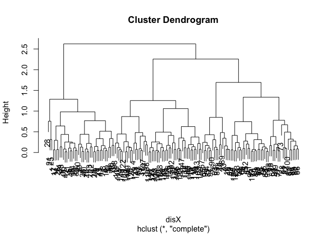
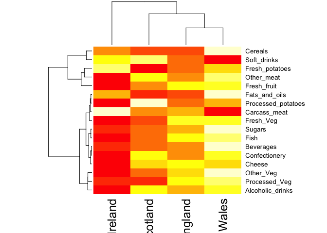

Class 8
================
10/25/2018

K-means clustering
------------------

Our first example with **kmeans()** function.

``` r
# Example plot to see how Rmarkdown works
# Shortcut for insert code chunks: option+command+i
plot(1:10, typ = "l")
```


Back to kmeans

``` r
# Generate some example data for clustering
tmp <- c(rnorm(30,-3), rnorm(30,3))  # this is a vector, c is used to concatenate
x <- cbind(x=tmp, y=rev(tmp))
plot(x)
```


Use the kmeans() function setting k to 2 and nstart=20

``` r
k <- kmeans(x, centers = 2, nstart = 20)
```

Inspect/print the results

``` r
print(k)
```

    ## K-means clustering with 2 clusters of sizes 30, 30
    ## 
    ## Cluster means:
    ##           x         y
    ## 1 -3.054411  2.765770
    ## 2  2.765770 -3.054411
    ## 
    ## Clustering vector:
    ##  [1] 1 1 1 1 1 1 1 1 1 1 1 1 1 1 1 1 1 1 1 1 1 1 1 1 1 1 1 1 1 1 2 2 2 2 2
    ## [36] 2 2 2 2 2 2 2 2 2 2 2 2 2 2 2 2 2 2 2 2 2 2 2 2 2
    ## 
    ## Within cluster sum of squares by cluster:
    ## [1] 58.82577 58.82577
    ##  (between_SS / total_SS =  89.6 %)
    ## 
    ## Available components:
    ## 
    ## [1] "cluster"      "centers"      "totss"        "withinss"    
    ## [5] "tot.withinss" "betweenss"    "size"         "iter"        
    ## [9] "ifault"

Q. How many points are in each cluster?

``` r
k$size
```

    ## [1] 30 30

-   there are 30 points in each cluster

Q. What ‘component’ of your result object details - cluster size: `k$size` - cluster assignment/membership: clustering vector

``` r
table(k$cluster)
```

    ## 
    ##  1  2 
    ## 30 30

    - cluster center: values in cluster means

``` r
k$centers
```

    ##           x         y
    ## 1 -3.054411  2.765770
    ## 2  2.765770 -3.054411

    - Within cluster sum of squares by cluster: square distance to the center

Plot x colored by the kmeans cluster assignment and add cluster centers as blue points

``` r
palette(c("blue", "black"))
plot(x, col = k$cluster)
points(k$centers, col = "red", pch = 20, cex = 3)
```


Q. Repeat for k=3, which has the lower tot.withinss?

``` r
k3 <- kmeans(x, centers = 3, nstart = 20)
k4 <- kmeans(x, centers = 4, nstart = 20)
k10 <- kmeans(x, centers = 10, nstart = 20)
k10$tot.withinss
```

    ## [1] 22.84634

``` r
k4$tot.withinss
```

    ## [1] 63.39695

``` r
k3$tot.withinss
```

    ## [1] 90.52425

``` r
k$tot.withinss
```

    ## [1] 117.6515

``` r
plot(c(k$tot.withinss, k3$tot.withinss, k4$tot.withinss, k10$tot.withinss))
```


-   k=3 has a lower tot.withinss (larger k will result lower tot.withinss) Major disadvantage is that we have to give a k value each time.

Hierarchical clustering in R
============================

Let's try out the **hclust()** function for Hierarchical clustering in R. This function need a **distance matrix** as input.

``` r
d <- dist(x)
hc <- hclust(d)
#this plots a dendrogram 
plot(hc)
# Draw a line on the dendrogram
abline(h = 8, col = "red")
```


``` r
# Cut the tree to yeild cluster membership vector
cutree(hc, h = 8)  #cut by height
```

    ##  [1] 1 1 1 1 1 1 1 1 1 1 1 1 1 1 1 1 1 1 1 1 1 1 1 1 1 1 1 1 1 1 2 2 2 2 2
    ## [36] 2 2 2 2 2 2 2 2 2 2 2 2 2 2 2 2 2 2 2 2 2 2 2 2 2

``` r
cutree(hc, k = 2)  #cut by k groups
```

    ##  [1] 1 1 1 1 1 1 1 1 1 1 1 1 1 1 1 1 1 1 1 1 1 1 1 1 1 1 1 1 1 1 2 2 2 2 2
    ## [36] 2 2 2 2 2 2 2 2 2 2 2 2 2 2 2 2 2 2 2 2 2 2 2 2 2

Using different hierarchical clustering methods

``` r
hc.complete <- hclust(d, method="complete")
hc.average <- hclust(d, method="average")
hc.single <- hclust(d, method="single")
```

### A more real example of hierarchical clustering

``` r
### Step 1. Generate some example data for clustering
x <- rbind(
matrix(rnorm(100, mean=0, sd = 0.3), ncol = 2), # c1
matrix(rnorm(100, mean = 1, sd = 0.3), ncol = 2), # c2
matrix(c(rnorm(50, mean = 1, sd = 0.3), # c3
rnorm(50, mean = 0, sd = 0.3)), ncol = 2))
colnames(x) <- c("x", "y")
# Step 2. Plot the data without clustering
plot(x)
```


``` r
# Step 3. Generate colors for known clusters
# (just so we can compare to hclust results)
palette(c("red","blue","black"))
col <- as.factor( rep(c("c1","c2","c3"), each=50) )
plot(x, col=col, pch = 20)
```


Q. Use the dist(), hclust(), plot() and cutree() functions to return 2 and 3 clusters

``` r
disX <- dist(x)
hcx <- hclust(disX)
plot(hcx)
```



``` r
cluster2 <- cutree(hcx, k =2)  #return 2 clusters
cluster3 <- cutree(hcx, k =3)  #return 3 clusters
palette(c("red","blue", "yellow"))
plot(x, col = cluster2, pch = 20)
```


``` r
plot(x, col = cluster3, pch = 20)
```


Q. How does this compare to your known 'col' groups?

``` r
table(cluster3, col)
```

    ##         col
    ## cluster3 c1 c2 c3
    ##        1 41  0  0
    ##        2  9  8 50
    ##        3  0 42  0

Using principal component analysis (PCA) in R
=============================================

Generate a gene expression table

``` r
# Initialize a blank 100 row by 10 column matrix
mydata <- matrix(nrow=100, ncol=10)
# Lets label the rows gene1, gene2 etc. to gene100
rownames(mydata) <- paste("gene", 1:100, sep="")
# Lets label the first 5 columns from wt1 to wt5 and the last 5 fromko1 to ko5
colnames(mydata) <- c( paste("wt", 1:5, sep=""),
paste("ko", 1:5, sep="") )
# Fill in some fake read counts
for(i in 1:nrow(mydata)) {
wt.values <- rpois(5, lambda=sample(x=10:1000, size=1))
ko.values <- rpois(5, lambda=sample(x=10:1000, size=1))
mydata[i,] <- c(wt.values, ko.values)
}
head(mydata)
```

    ##       wt1 wt2 wt3 wt4 wt5 ko1 ko2 ko3 ko4 ko5
    ## gene1 249 233 258 251 221 747 733 717 756 774
    ## gene2 767 669 756 752 757 609 584 609 564 592
    ## gene3 759 684 709 767 784 279 285 300 284 308
    ## gene4 668 684 628 650 655 130 140 128 129 124
    ## gene5 875 822 810 843 850 773 747 744 697 732
    ## gene6 365 336 355 340 343 416 373 338 383 402

Note the prcomp() function wants us to take the transposed data of our matrix with column and rows flipped

``` r
head(t(mydata))
```

    ##     gene1 gene2 gene3 gene4 gene5 gene6 gene7 gene8 gene9 gene10 gene11
    ## wt1   249   767   759   668   875   365   274   499   129    105    912
    ## wt2   233   669   684   684   822   336   291   514   145    108    960
    ## wt3   258   756   709   628   810   355   282   541   120    116    943
    ## wt4   251   752   767   650   843   340   256   540   124    113    944
    ## wt5   221   757   784   655   850   343   287   535   126    123   1007
    ## ko1   747   609   279   130   773   416   871   658   853    580    524
    ##     gene12 gene13 gene14 gene15 gene16 gene17 gene18 gene19 gene20 gene21
    ## wt1    885    556    592    720     43    124    257    735    821    478
    ## wt2    845    574    576    658     47    132    293    731    861    467
    ## wt3    942    580    558    713     46    131    285    761    893    444
    ## wt4    927    570    551    736     42    121    282    727    853    449
    ## wt5    915    579    586    673     47    119    254    723    860    443
    ## ko1    720    942    526    366    149    944    234    162    709    234
    ##     gene22 gene23 gene24 gene25 gene26 gene27 gene28 gene29 gene30 gene31
    ## wt1    675    550    954     37    359    330    323    135    654    820
    ## wt2    696    507    897     39    393    304    322    131    661    774
    ## wt3    734    525    881     30    391    319    316    111    689    826
    ## wt4    737    519    921     25    406    302    325    141    701    803
    ## wt5    731    522    923     50    377    311    349    141    631    860
    ## ko1    902    687    310    894    689    842    100    740    871    451
    ##     gene32 gene33 gene34 gene35 gene36 gene37 gene38 gene39 gene40 gene41
    ## wt1    958    227    912    243    201    609     79    806    700    559
    ## wt2    951    227    875    229    173    627     78    800    720    629
    ## wt3    927    242    931    236    176    598     64    814    704    597
    ## wt4    949    243    861    237    176    661     71    749    683    659
    ## wt5    999    236    890    234    188    654     76    818    713    594
    ## ko1    771    607    626    461    940    435    545    877    221    580
    ##     gene42 gene43 gene44 gene45 gene46 gene47 gene48 gene49 gene50 gene51
    ## wt1    537    722    238     21    820    534    713    185     82    478
    ## wt2    530    732    256     24    855    587    696    190     79    481
    ## wt3    502    759    241     24    927    594    741    171     71    464
    ## wt4    518    734    263     26    896    612    697    203     79    464
    ## wt5    530    760    248     28    897    564    708    197     81    473
    ## ko1    730    165    645    380    139    317    783    207    845     88
    ##     gene52 gene53 gene54 gene55 gene56 gene57 gene58 gene59 gene60 gene61
    ## wt1    284    691    767     14     75    722    475    275    570    850
    ## wt2    299    693    748      7     80    681    516    280    626    895
    ## wt3    268    679    741      6     88    670    460    258    569    872
    ## wt4    282    666    718     12     60    665    496    294    598    919
    ## wt5    309    670    701     15     81    712    487    289    594    871
    ## ko1     93    733    597    864    456    335    884     88    158    900
    ##     gene62 gene63 gene64 gene65 gene66 gene67 gene68 gene69 gene70 gene71
    ## wt1    207    222    532     30    967    681    960     89    591    630
    ## wt2    225    205    500     18    943    680    981    126    603    640
    ## wt3    218    208    517     32    994    682    958    104    640    640
    ## wt4    220    193    535     20    965    652    935    109    626    648
    ## wt5    229    206    532     29    987    682   1000    113    595    627
    ## ko1     46    589    222    311    716    338    814    579    729    114
    ##     gene72 gene73 gene74 gene75 gene76 gene77 gene78 gene79 gene80 gene81
    ## wt1    244    601    469    236    738    507    180    452    437    216
    ## wt2    237    606    468    243    701    505    202    460    438    193
    ## wt3    221    641    502    261    728    543    209    469    461    207
    ## wt4    222    600    505    241    748    501    200    488    424    179
    ## wt5    230    611    516    234    727    512    180    452    456    197
    ## ko1    684    187    767    712    281     15    776    309     97    131
    ##     gene82 gene83 gene84 gene85 gene86 gene87 gene88 gene89 gene90 gene91
    ## wt1    317    746    622    746    904    863    878    962    933   1038
    ## wt2    326    686    637    735    891    872    869    938    920   1058
    ## wt3    337    688    670    769    827    854    877    962    942    999
    ## wt4    354    650    646    740    831    868    887    920    908   1001
    ## wt5    331    680    614    730    869    846    951    949    907    964
    ## ko1    555    930    659    710    993    852    657    633    744    453
    ##     gene92 gene93 gene94 gene95 gene96 gene97 gene98 gene99 gene100
    ## wt1    260    278    195    987    600    633    947    640     535
    ## wt2    280    292    176   1014    579    692    881    635     569
    ## wt3    259    283    216    945    576    613    936    626     575
    ## wt4    271    283    166   1010    577    652    861    685     518
    ## wt5    268    302    187    959    601    705    892    612     543
    ## ko1    817    755    838    294    541    858    147    371     249

Now let's try find structure in this data with **prcomp()**

``` r
pca <- prcomp(t(mydata), scale = TRUE)
#see what's returned by prcomp using attributes()
attributes(pca)
```

    ## $names
    ## [1] "sdev"     "rotation" "center"   "scale"    "x"       
    ## 
    ## $class
    ## [1] "prcomp"

Make a PC plot of PC1 vs PC2, using `$x` component of output (pca$x)

``` r
plot(pca$x[,1], pca$x[,2])
```


Looking the variance from the original data that we are capturing

``` r
#variance: squared stdev
pca.var <- pca$sdev^2
pca.var
```

    ##  [1] 9.084016e+01 2.562270e+00 2.230566e+00 1.259004e+00 1.046594e+00
    ##  [6] 1.015564e+00 3.725716e-01 3.589090e-01 3.143649e-01 1.458596e-29

``` r
#getting the percentage variance 
pca.var.per <- round(pca.var/sum(pca.var)*100,1)
pca.var.per
```

    ##  [1] 90.8  2.6  2.2  1.3  1.0  1.0  0.4  0.4  0.3  0.0

Making the basic PCA plot more useful

``` r
## A vector of colors for wt and ko samples
colvec <- colnames(mydata)
colvec[grep("wt", colvec)] <- "red"
colvec[grep("ko", colvec)] <- "blue"
plot(pca$x[,1], pca$x[,2], col=colvec, pch=16,
xlab=paste0("PC1 (", pca.var.per[1], "%)"),
ylab=paste0("PC2 (", pca.var.per[2], "%)"))
```


Making a "Scree-plot"

``` r
barplot(pca.var.per, main="Scree Plot",
xlab="Principal Component", ylab="Percent Variation")
```


Looking at the loading scores

``` r
# Lets focus on PC1 as it accounts for > 90% of variance
loading_scores <- pca$rotation[,1]
summary(loading_scores)
```

    ##      Min.   1st Qu.    Median      Mean   3rd Qu.      Max. 
    ## -0.104838 -0.104183 -0.016804 -0.002521  0.104260  0.104882

``` r
# We are interested in the magnitudes of both plus and minus contributing genes
gene_scores <- abs(loading_scores)
# Sort by magnitudes from high to low
gene_score_ranked <- sort(gene_scores, decreasing=TRUE)
# Find the names of the top 5 genes
top_5_genes <- names(gene_score_ranked[1:5])
# Show the scores (with +/- sign)
pca$rotation[top_5_genes,1]
```

    ##     gene55     gene94     gene71      gene9     gene25 
    ##  0.1048819  0.1048395 -0.1048378  0.1048374  0.1048373

Try using what learned today to analyze UK food data
====================================================

First read the food data and its dimension

``` r
x <- read.csv("UK_foods.csv")
#reformat the row names
rownames(x) <- x[,1]
x <- x[,-1]
head(x)
```

    ##                England Wales Scotland N.Ireland
    ## Cheese             105   103      103        66
    ## Carcass_meat       245   227      242       267
    ## Other_meat         685   803      750       586
    ## Fish               147   160      122        93
    ## Fats_and_oils      193   235      184       209
    ## Sugars             156   175      147       139

``` r
#check the dimension of x 
dim(x)
```

    ## [1] 17  4

Read the whole data

``` r
knitr::kable(x, caption="The full UK foods data table")
```

|                     |  England|  Wales|  Scotland|  N.Ireland|
|---------------------|--------:|------:|---------:|----------:|
| Cheese              |      105|    103|       103|         66|
| Carcass\_meat       |      245|    227|       242|        267|
| Other\_meat         |      685|    803|       750|        586|
| Fish                |      147|    160|       122|         93|
| Fats\_and\_oils     |      193|    235|       184|        209|
| Sugars              |      156|    175|       147|        139|
| Fresh\_potatoes     |      720|    874|       566|       1033|
| Fresh\_Veg          |      253|    265|       171|        143|
| Other\_Veg          |      488|    570|       418|        355|
| Processed\_potatoes |      198|    203|       220|        187|
| Processed\_Veg      |      360|    365|       337|        334|
| Fresh\_fruit        |     1102|   1137|       957|        674|
| Cereals             |     1472|   1582|      1462|       1494|
| Beverages           |       57|     73|        53|         47|
| Soft\_drinks        |     1374|   1256|      1572|       1506|
| Alcoholic\_drinks   |      375|    475|       458|        135|
| Confectionery       |       54|     64|        62|         41|

Plot a heatmap from this data set

``` r
#par(mar=c(20, 4, 4, 2))
heatmap(as.matrix(x))
```



Functions covered today
=======================

kmeans(x) hclust(dist(x)) cutree(hc) prcomp(x, scale = TRUE) table()
