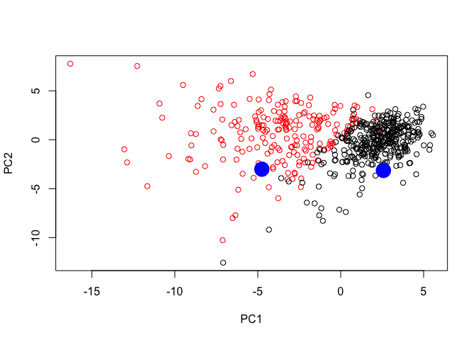

Lecture 9: Unsupervised Learning Analysis of Cancer Cells
================
10/30/2018

Secion 1: Import the data
=========================

``` r
url <- "https://bioboot.github.io/bimm143_S18/class-material/WisconsinCancer.csv"
wisc.df <- read.csv(url)
# Use as.matrix() to convert the other features (i.e. columns) of the data 
# (in columns 3 through 32) to a matrix. Store this in a variable called wisc.data.
wisc.data <- as.matrix(wisc.df[,3:32])
#Assign the row names of wisc.data the values currently 
#contained in the id column of wisc.df.
row.names(wisc.data) <- wisc.df$id
#Finally, setup a separate new vector called diagnosis to be 1 (TRUE) if 
#a diagnosis is malignant ("M") and 0 (FALSE) otherwise.
diagnosis <- as.numeric (wisc.df$diagnosis == "M")  #as.numeric turns logics to 0 and 1
```

Exploratory data analysis
-------------------------

The first step of any data analysis, unsupervised or supervised, is to familiarize yourself with the data. Explore the data you created before (wisc.data and diagnosis) to answer the following questions:

Q1. How many observations are in this dataset?

``` r
dim(wisc.df)
```

    ## [1] 569  33

There are 569 patients and 33 variables tested on these patients

Q2. How many variables/features in the data are suffixed with \_mean?

``` r
x <- length (grep("_mean", colnames(wisc.data)))
```

There are 10 mean measurements in the dataset.

Q3. How many of the observations have a malignant diagnosis?

``` r
x <- sum(diagnosis)
```

There are 212 malignant diagnosis.

Section 2: Performing PCA
=========================

The next step in your analysis is to perform principal component analysis (PCA) on wisc.data.

It is important to check if the data need to be scaled before performing PCA. Recall two common reasons for scaling data include: The input variables use different units of measurement. The input variables have significantly different variances. Check the mean and standard deviation of the features (i.e. columns) of the wisc.data to determine if the data should be scaled. Use the colMeans() and apply() functions like you’ve done before.

``` r
#calculate column means
means <- colMeans(wisc.data)
#calculate column standard deviation
stdev <- apply(wisc.data, 2, sd)
```

Execute PCA with the prcomp() function on the wisc.data, scaling if appropriate, and assign the output model to wisc.pr.

``` r
wisc.pr <- prcomp(wisc.data, scale. = TRUE)
summary(wisc.pr)
```

    ## Importance of components:
    ##                           PC1    PC2     PC3     PC4     PC5     PC6
    ## Standard deviation     3.6444 2.3857 1.67867 1.40735 1.28403 1.09880
    ## Proportion of Variance 0.4427 0.1897 0.09393 0.06602 0.05496 0.04025
    ## Cumulative Proportion  0.4427 0.6324 0.72636 0.79239 0.84734 0.88759
    ##                            PC7     PC8    PC9    PC10   PC11    PC12
    ## Standard deviation     0.82172 0.69037 0.6457 0.59219 0.5421 0.51104
    ## Proportion of Variance 0.02251 0.01589 0.0139 0.01169 0.0098 0.00871
    ## Cumulative Proportion  0.91010 0.92598 0.9399 0.95157 0.9614 0.97007
    ##                           PC13    PC14    PC15    PC16    PC17    PC18
    ## Standard deviation     0.49128 0.39624 0.30681 0.28260 0.24372 0.22939
    ## Proportion of Variance 0.00805 0.00523 0.00314 0.00266 0.00198 0.00175
    ## Cumulative Proportion  0.97812 0.98335 0.98649 0.98915 0.99113 0.99288
    ##                           PC19    PC20   PC21    PC22    PC23   PC24
    ## Standard deviation     0.22244 0.17652 0.1731 0.16565 0.15602 0.1344
    ## Proportion of Variance 0.00165 0.00104 0.0010 0.00091 0.00081 0.0006
    ## Cumulative Proportion  0.99453 0.99557 0.9966 0.99749 0.99830 0.9989
    ##                           PC25    PC26    PC27    PC28    PC29    PC30
    ## Standard deviation     0.12442 0.09043 0.08307 0.03987 0.02736 0.01153
    ## Proportion of Variance 0.00052 0.00027 0.00023 0.00005 0.00002 0.00000
    ## Cumulative Proportion  0.99942 0.99969 0.99992 0.99997 1.00000 1.00000

Q4. From your results, what proportion of the original variance is captured by the first principal components (PC1)? -- 0.4427

Q5. How many principal components (PCs) are required to describe at least 70% of the original variance in the data? -- 3 PCs

Q6. How many principal components (PCs) are required to describe at least 90% of the original variance in the data? -- 7 PCs

Interpreting PCA results
------------------------

Now you will use some visualizations to better understand your PCA model. A common visualization for PCA results is the so-called biplot.

However, you will often run into some common challenges with using biplots on real-world data containing a non-trivial number of observations and variables. Here we will need to look at some alternative visualizations. You are encouraged to experiment with additional visualizations before moving on to the next section

Create a biplot of the wisc.pr using the biplot() function.

``` r
biplot(wisc.pr)
```


Q7. What stands out to you about this plot? Is it easy or difficult to understand? Why? -- The plot is very messy and hard to understand because this plot puts all the varibles together in one plot

Rownames are used as the plotting character for biplots like this one which can make trends rather hard to see. Lets generate a more standard scatter plot of each observation along principal components 1 and 2 (i.e. a plot of PC1 vs PC2 available as the first two columns of wisc.pr$x) and color the points by the diagnosis (available in the diagnosis vector you created earlier).

``` r
attributes(wisc.pr)  
```

    ## $names
    ## [1] "sdev"     "rotation" "center"   "scale"    "x"       
    ## 
    ## $class
    ## [1] "prcomp"

``` r
plot(wisc.pr$x[,1], wisc.pr$x[,2])
```


``` r
plot(wisc.pr$x[,1], wisc.pr$x[,2], col = diagnosis+1, 
     xlab = "PC1", ylab = "PC2")  # 0 will be colored white so +1 will change its color
```


Q8. Repeat the same for principal components 1 and 3. What do you notice about these plots?

``` r
plot(wisc.pr$x[,1], wisc.pr$x[,3], xlab = "PC1", ylab = "PC3", col = diagnosis+1)
```


Because principal component 2 explains more variance in the original data than principal component 3, you can see that the first plot has a cleaner cut separating the two subgroups.

Overall, the plots indicate that principal component 1 is capturing a separation of malignant from benign samples. This is an important and interesting result worthy of further exploration - as we will do in the next sections!

Variance explained
------------------

In this exercise, you will produce scree plots showing the proportion of variance explained as the number of principal components increases. The data from PCA must be prepared for these plots, as there is not a built-in function in base R to create them directly from the PCA model.

As you look at these plots, ask yourself if there’s an ‘elbow’ in the amount of variance explained that might lead you to pick a natural number of principal components. If an obvious elbow does not exist, as is typical in some real-world datasets, consider how else you might determine the number of principal components to retain based on the scree plot.

Calculate the variance of each principal component by squaring the sdev component of wisc.pr (i.e. wisc.pr$sdev^2). Save the result as an object called pr.var.

``` r
pr.var <- wisc.pr$sdev^2
```

Calculate the variance explained by each principal component by dividing by the total variance explained of all principal components. Assign this to a variable called pve and create a plot of variance explained for each principal component.

``` r
#calcuating pve as the variance of each PC divided by the sum of variance of each 
#PC, this is a ratio and we assign it as pve
pve <- pr.var/sum(pr.var)
#plot pve as a line graph
plot(pve, type = "o", ylim = c(0,0.5), xlab = "Principal Component", 
     ylab = "porpotion of variance explained")
```


``` r
#plot a barplot of pve
barplot(pve, ylim = c(0,0.5), names.arg = paste0("PC",1:length(pve)) , las = 2,
        xlab = "", ylab = "Percent of varaiance explained")
```


``` r
#data-driven y-axis for alternative barplot 
barplot(pve, names.arg = paste0("PC",1:length(pve)), las = 2,
        xlab = "", ylab = "Percent of varaiance explained", axes = FALSE)
axis(2, at = pve, labels = round(pve,2)*100)
```


Using the cumsum() function, create a plot of cumulative proportion of variance explained.

``` r
sumVar <- cumsum(pve)
plot(sumVar, ylim = c(0,1), type = "o", xlab = "Principal Component", 
     ylab = "Cumulative Proportion of Variance Explained")
```


Section 3: Hierarchical clustering of case data
===============================================

The goal of this section is to do hierarchical clustering of the observations. Recall from our last class that this type of clustering does not assume in advance the number of natural groups that exist in the data.

As part of the preparation for hierarchical clustering, the distance between all pairs of observations are computed. Furthermore, there are different ways to link clusters together, with single, complete, and average being the most common linkage methods.

Scale the wisc.data data and assign the result to data.scaled.

``` r
data.scaled <- scale(wisc.data)
```

Calculate the (Euclidean) distances between all pairs of observations in the new scaled dataset and assign the result to data.dist.

``` r
data.dist <- dist(data.scaled)
```

Create a hierarchical clustering model using complete linkage. Manually specify the method argument to hclust() and assign the results to wisc.hclust.

``` r
wisc.hclust <- hclust(data.dist, method = "complete")
```

Results of hierarchical clustering
----------------------------------

Let’s use the hierarchical clustering model you just created to determine a height (or distance between clusters) where a certain number of clusters exists.

Q11. Using the plot() function, what is the height at which the clustering model has 4 clusters?

``` r
plot(wisc.hclust)
```


Selecting number of clusters
----------------------------

In this section, you will compare the outputs from your hierarchical clustering model to the actual diagnoses. Normally when performing unsupervised learning like this, a target variable (i.e. known answer or labels) isn’t available. We do have it with this dataset, however, so it can be used to check the performance of the clustering model.

When performing supervised learning - that is, when you’re trying to predict some target variable of interest and that target variable is available in the original data - using clustering to create new features may or may not improve the performance of the final model.

This exercise will help you determine if, in this case, hierarchical clustering provides a promising new feature.

Use cutree() to cut the tree so that it has 4 clusters. Assign the output to the variable wisc.hclust.clusters.

``` r
wisc.hclust.clusters <- cutree(wisc.hclust, k = 4)
table(wisc.hclust.clusters)
```

    ## wisc.hclust.clusters
    ##   1   2   3   4 
    ## 177   7 383   2

We can use the table() function to compare the cluster membership to the actual diagnoses.

``` r
table(wisc.hclust.clusters, diagnosis)
```

    ##                     diagnosis
    ## wisc.hclust.clusters   0   1
    ##                    1  12 165
    ##                    2   2   5
    ##                    3 343  40
    ##                    4   0   2

Here we picked four clusters and see that cluster 1 largely corresponds to malignant cells (with diagnosis values of 1) whilst cluster 3 largely corresponds to benign cells (with diagnosis values of 0).

Section 4: K-means clustering and comparing results
===================================================

As you now know, there are two main types of clustering: hierarchical and k-means.

In this section, you will create a k-means clustering model on the Wisconsin breast cancer data and compare the results to the actual diagnoses and the results of your hierarchical clustering model. Take some time to see how each clustering model performs in terms of separating the two diagnoses and how the clustering models compare to each other.

Create a k-means model on wisc.data, assigning the result to wisc.km. Be sure to create 2 clusters, corresponding to the actual number of diagnosis. Also, remember to scale the data (with the scale() function and repeat the algorithm 20 times (by setting setting the value of the nstart argument appropriately). Running multiple times such as this will help to find a well performing model.

``` r
wisc.km <- kmeans(data.scaled, centers = 2, nstart = 20)
```

Section 5: Clustering on PCA results
====================================

In this final section, you will put together several steps you used earlier and, in doing so, you will experience some of the creativity and open endedness that is typical in unsupervised learning.

Recall from earlier sections that the PCA model required significantly fewer features to describe 70%, 80% and 95% of the variability of the data. In addition to normalizing data and potentially avoiding over-fitting, PCA also uncorrelates the variables, sometimes improving the performance of other modeling techniques.

Let’s see if PCA improves or degrades the performance of hierarchical clustering.

Using the minimum number of principal components required to describe at least 90% of the variability in the data, create a hierarchical clustering model with complete linkage. Assign the results to wisc.pr.hclust.

``` r
# Use the distance along the first 7 PCs for clustering i.e. wisc.pr$x[, 1:7]
d.pr <- dist(wisc.pr$x[, 1:7])
wisc.pr.hclust <- hclust(d.pr, method = "complete")
plot(wisc.pr.hclust)
```


Cut this hierarchical clustering model into 4 clusters and assign the results to wisc.pr.hclust.clusters.

``` r
wisc.pr.hclust.clusters <- cutree(wisc.pr.hclust, k = 4)
table(wisc.pr.hclust.clusters)
```

    ## wisc.pr.hclust.clusters
    ##   1   2   3   4 
    ## 118 447   2   2

Using table(), compare the results from your new hierarchical clustering model with the actual diagnoses.

``` r
table(wisc.pr.hclust.clusters, diagnosis)
```

    ##                        diagnosis
    ## wisc.pr.hclust.clusters   0   1
    ##                       1   5 113
    ##                       2 350  97
    ##                       3   2   0
    ##                       4   0   2

Bonus: Predicting Malignancy Of New samples
-------------------------------------------

Take the new predicting model on our PCA model above

``` r
#Predicting maglinancy
url <- "https://tinyurl.com/new-samples-CSV"
new <- read.csv(url)
npc <- predict(wisc.pr, newdata=new)
plot(wisc.pr$x[,1:2], col= diagnosis+1)
points(npc[,1], npc[,2], col="blue", pch=16, cex = 3) #add prediction to existing graph
```


